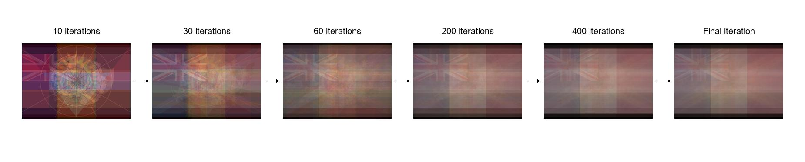
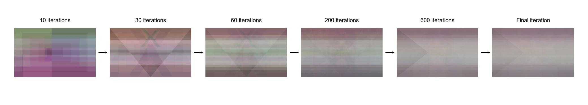

# Flag Averaging Project
This project generates the "average" flag by combining multiple flag images using pixel-wise averaging.

We currently have averaging for: Countries and Pride Flags

## Showcase
Here's a visual representation of how the average country flag evolves as more flags are added to the mix:



And how the average pride flag evolves as more flags are added to the mix:



## Usage
To use this project, follow the steps below:

1. **Install all requirements**:
    ```sh
    python3 -m pip install -r requirements.txt
    ```

1. **Download a list of flags**:
    ```python
    python3 src/gather.py <country|pride>
    ```

2. **Normalize the images to a standard aspect ratio**:
    ```python
    python3 src/normalise.py <country|pride>
    ```

3. **Verify that the aspect ratios are consistent**:
    ```python
    python3 test/aspect.py <country|pride>
    ```

4. **Generate the average flag**:
    ```python
    python3 src/main.py <country|pride>
    ```

## Dependencies
Ensure you have the following dependencies installed:

- Python 3.x
- Pillow (PIL)
- NumPy

## Contributing
Contributions are welcome! If you have suggestions for improvements or new features/flags, please follow these steps:

1) Fork the repository.
2) Create a new branch for your feature or bugfix:
    ```sh
    git checkout -b feature-name
    ```
3) Commit your changes:
    ```sh
    git commit -m "Description of feature or fix"
    ```
4) Push to the branch:
    ```sh
    git push origin feature-name
    ```
5) Open a pull request with a detailed description of your changes.

# Acknowledgements
I would like to thank:

[pronouns/pride-flags-png](https://github.com/pronouns/pride-flags-png) for the list of pride flag images

[hampusborgos/country-flags](https://github.com/hampusborgos/country-flags) for the list of country flag images